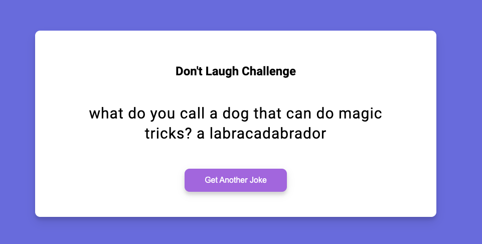

# Dad Jokes Web App

This project is a simple web application that fetches dad jokes from an API and allows users to display jokes with a click of a button. The application also includes a feature to cache the last fetched joke using localStorage.

## Demo
[Live Demo](https://dadjokesgalore.netlify.app/)

## Live Project

## Author
Created by Brian Shifoko

## Technologies Used
- HTML
- CSS (including responsive design)
- JavaScript (including async fetch and localStorage)

## Setup Instructions
To run this project locally, follow these steps:
1. Clone the repository.
2. Open `index.html` in your web browser.

## Additional Notes
- Ensure you have an active internet connection to fetch jokes from the API.
- For development, consider optimizing error handling and API request management further.

Feel free to contribute and improve upon this project by submitting pull requests.
